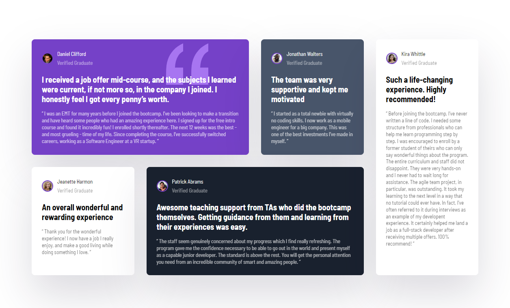

# Frontend Mentor - Testimonials grid section solution

This is a solution to the [Testimonials grid section challenge on Frontend Mentor](https://www.frontendmentor.io/challenges/testimonials-grid-section-Nnw6J7Un7). Frontend Mentor challenges help you improve your coding skills by building realistic projects. 

## Table of contents

- [Overview](#overview)
  - [The challenge](#the-challenge)
  - [Screenshot](#screenshot)
  - [Links](#links)
- [My process](#my-process)
  - [Built with](#built-with)
  - [Useful resources](#useful-resources)
- [Author](#author)

**Note: Delete this note and update the table of contents based on what sections you keep.**

## Overview

### The challenge

Users should be able to:

- View the optimal layout for the site depending on their device's screen size

### Screenshot

### Links

- Solution URL: [Frontend Mentor Solution](https://www.frontendmentor.io/solutions/testimonials-grid-section-3U7qg1xrQo)
- Live Site URL: [Live site at Netlify](https://brilliant-stroopwafel-227c5e.netlify.app/)

## My process

### Built with

- Semantic HTML5 markup
- BEM
- Flexbox
- CSS Grid

### Useful resources

- [Brad Traversy's CSS Grid Crash Course 2022](https://www.youtube.com/watch?v=0xMQfnTU6oo) - This helped referesh my memory on how to use CSS Grid, and allowed me to complete this challenge. 

## Author

- Frontend Mentor - [@JGedd](https://www.frontendmentor.io/profile/JGedd)
- Twitter - [@John_geddis](https://twitter.com/john_geddis)

